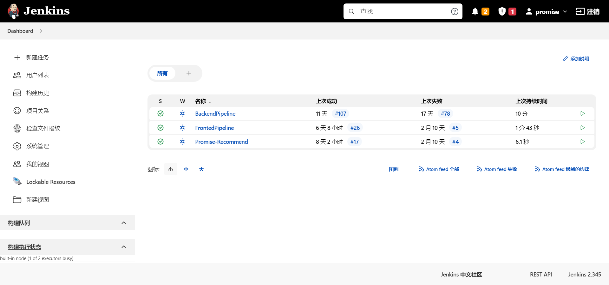
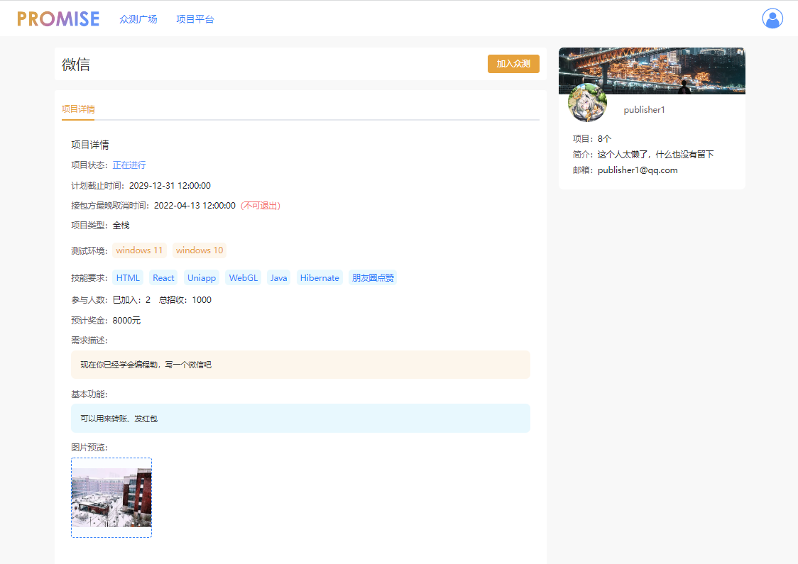

- [1. 项目概述](#1-项目概述)
  - [1.1 目录结构](#11-目录结构)
  - [1.2 项目组成](#12-项目组成)
    - [1.2.1 项目整体架构](#121-项目整体架构)
    - [1.2.2 业务系统架构](#122-业务系统架构)
  - [1.3 项目技术栈](#13-项目技术栈)
  - [1.4 项目访问方式](#14-项目访问方式)
  - [1.5 服务器资源使用情况](#15-服务器资源使用情况)
- [2. 云原生PaaS平台介绍(重点)](#2-云原生paas平台介绍重点)
  - [2.1 架构介绍](#21-架构介绍)
  - [2.2 自动化CI/CD流程](#22-自动化cicd流程)
  - [2.3 功能截图](#23-功能截图)
    - [2.3.1 云原生PaaS平台](#231-云原生paas平台)
      - [2.3.1.1 集群节点组成](#2311-集群节点组成)
      - [2.3.1.2 命名空间列表](#2312-命名空间列表)
      - [2.3.1.3 业务系统部署](#2313-业务系统部署)
    - [2.3.2 Jenkins](#232-jenkins)
      - [2.3.2.1 Jenkins首页](#2321-jenkins首页)
      - [2.3.2.2 后端流水线](#2322-后端流水线)
- [3. 业务系统介绍](#3-业务系统介绍)
  - [3.1 功能介绍](#31-功能介绍)
  - [3.2 业务系统架构](#32-业务系统架构)
  - [3.3 功能截图](#33-功能截图)
    - [3.3.1 众测人员](#331-众测人员)
      - [3.3.1.1 游览众测任务，系统为开发人员推荐众测任务](#3311-游览众测任务系统为开发人员推荐众测任务)
      - [3.3.1.2 查看众测任务详情](#3312-查看众测任务详情)
      - [3.3.1.3 填写众测报告](#3313-填写众测报告)
      - [3.3.1.4 设置偏好](#3314-设置偏好)
    - [3.3.2 任务发布者](#332-任务发布者)
      - [3.3.2.1 发布待测任务](#3321-发布待测任务)
      - [3.3.2.2 设定测试需求](#3322-设定测试需求)
      - [3.3.2.3 上传测试所需文件](#3323-上传测试所需文件)
      - [3.3.2.4 查看测试报告](#3324-查看测试报告)
      - [3.3.2.5 为完成的任务生成分析报告](#3325-为完成的任务生成分析报告)
- [4. 可用性保障(重点)](#4-可用性保障重点)
  - [4.1 利用Kubernetes提供的特性](#41-利用kubernetes提供的特性)
  - [4.2 微服务架构带来的好处](#42-微服务架构带来的好处)
  - [4.3 实现故障转移(不了解k8s可能看不懂)](#43-实现故障转移不了解k8s可能看不懂)
    - [4.3.1 未实现故障转移时存在的问题](#431-未实现故障转移时存在的问题)
    - [4.3.2 Pod删除流程](#432-pod删除流程)
    - [4.3.3 手动关机模拟Server崩溃](#433-手动关机模拟server崩溃)
    - [4.3.4 手动关机结果展示](#434-手动关机结果展示)
    - [4.3.5 原因分析与解决方案](#435-原因分析与解决方案)
    - [4.3.6 最终的故障转移流程](#436-最终的故障转移流程)
  - [4.4 实现无损上下线](#44-实现无损上下线)
    - [4.4.1 没有无损上下线时存在的问题](#441-没有无损上下线时存在的问题)
    - [4.4.2 优雅上线](#442-优雅上线)
    - [4.4.3 服务正常关闭时的优雅下线](#443-服务正常关闭时的优雅下线)
    - [4.4.4 服务异常关闭时的处理](#444-服务异常关闭时的处理)
      - [4.4.4.1 问题](#4441-问题)
      - [4.4.4.2 解决方案](#4442-解决方案)


# 1. 项目概述

## 1.1 目录结构

```
|-- backend (Java后端代码)
    |-- common (通用代码)
    |-- http-service (HTTP服务)
    |-- publish-service (发布服务)
    |-- publish-service-api (发布服务API)
    |-- test-service (测试服务)
    |-- test-service-api (测试服务API)
    |-- user-service (用户服务)
    |-- user-service-api (用户服务API)
|-- doc (项目文档和图片)
|-- frontend (前端代码)
|-- k8s-deploy (项目在Kubernetes集群上部署的脚本)
|-- recommend-python (推荐服务代码)
```


## 1.2 项目组成

这个项目分为两个模块——**云原生PaaS平台**和**众包测试平台（业务系统）**，云原生PaaS平台为业务系统提供运行环境和可用性保障，同时云原生PaaS平台集成了一系列的DevOps工具，实现了自动化CI/CD

### 1.2.1 项目整体架构


### 1.2.2 业务系统架构


## 1.3 项目技术栈

* **云原生PaaS平台**——Kubernetes，Jenkins，Docker，OSS，NFS，GitLab
* **众包测试平台**——Nacos，Dubbo，SpringBoot，MyBatis，MySQL，Redis


## 1.4 项目访问方式

* **业务系统**——http://150.158.158.176:30090/#/
  * **发布者**
    * 账号：moqi@moqi.com
    * 密码：123456789
  * **众测人员**
    * 账号：90747@qq.com
    * 密码：123456789
* **云原生PaaS平台**——http://150.158.158.176:30080/
  * 账号：visitor
  * 密码：visitor


## 1.5 服务器资源使用情况

* 使用了6台服务器构建一个Kubernetes集群
* 还使用了1台服务器来作为NFS服务器，并负责运行Jenkins
* 同时使用了阿里云OSS和阿里云镜像仓库


# 2. 云原生PaaS平台介绍(重点)

## 2.1 架构介绍


**云原生PaaS平台的组成如下**

* **PaaS平台核心**
  * **存储部分**
    * NFS——搭建了一台NFS服务器，来提供网络文件存储
    * OSS——阿里云的对象存储服务
    * 镜像仓库——使用阿里云镜像仓库来管理所有的镜像
  * **容器编排与集群管理**——搭建了一个6节点的Kubernetes集群，所有的服务都运行在该Kubernetes集群中
* **DevOps工具链**
  * **版本控制**——**Git+GitLab**
  * **自动化构建**——**Maven+Webpack**
  * **自动化测试**——**JUnit+Mockito+JaCoCo**
  * **CI/CD**——以**Jenkins**为核心，配合**Kubernetes**实现自动化的CI/CD
  * **容器化**——**Docker**
  * **Kubernetes控制台**——**Kuboard**


## 2.2 自动化CI/CD流程

.png)

1. 开发人员push代码
2. GitLab通过webhook触发Jenkins的流水线
3. Jenkins从GitLab拉取代码
4. Jenkins执行事先写好的构建脚本
   - 通过Maven，Webpack构建项目，同时会进行自动化测试，生成代码覆盖情况分析报告
   - 将构建好的项目打包成镜像，push到阿里云镜像仓库
5. Jenkins向Kubernetes集群发出版本更新命令
6. Kubernetes拉取最新版本的镜像滚动更新


## 2.3 功能截图

### 2.3.1 云原生PaaS平台

#### 2.3.1.1 集群节点组成


#### 2.3.1.2 命名空间列表

* 下图的`nacos`，`promise`，`redis`这三个命名空间是业务系统部署的命名空间


#### 2.3.1.3 业务系统部署

* 我们开发的业务系统主要部署在`promise`命名空间下，每个服务都有多个实例
* promise-recommend-deploy只有一个实例，是因为该服务占用内存太高，服务器资源不足


### 2.3.2 Jenkins

#### 2.3.2.1 Jenkins首页



#### 2.3.2.2 后端流水线


# 3. 业务系统介绍

## 3.1 功能介绍

Collect众包测试平台服务于测试任务发布者和众测人员

* 众测人员
  * 可以在平台上游览，接受任务，下载任务附件，在线填写众测报告，不同众测工人之间可以进行协作和相互评分
  * 众测人员可以设置自己的偏好，平台会根据众测人员的偏好为其推荐合适的任务
* 测试任务发布者
  * 发布者也可以在平台上游览任务，并且可以在平台上发布待测任务，设定测试需求，上传待测试的可执行文件/测试内容文档/其他说明文件
  * 发布者可以查看众测人员提交的测试报告，当测试任务结束后，平台为测试任务生成一个分析报告

## 3.2 业务系统架构


* 业务系统采用**微服务架构**，所有服务的**构建，管理，部署和运维监控**都依赖**云原生PaaS平台**

* 部署**Nacos集群**作为注册中心
* 根据业务特点，将后端拆分为了5个服务——**HTTP服务**，**发布服务**，**用户服务**，**测试服务**，**推荐服务**
* 每个服务都部署了**多个容器实例**，服务之间使用RPC通信框架**Dubbo**进行通信


## 3.3 功能截图

### 3.3.1 众测人员

#### 3.3.1.1 游览众测任务，系统为开发人员推荐众测任务


#### 3.3.1.2 查看众测任务详情



#### 3.3.1.3 填写众测报告


#### 3.3.1.4 设置偏好


### 3.3.2 任务发布者

#### 3.3.2.1 发布待测任务


#### 3.3.2.2 设定测试需求


#### 3.3.2.3 上传测试所需文件


#### 3.3.2.4 查看测试报告


#### 3.3.2.5 为完成的任务生成分析报告


# 4. 可用性保障(重点)

## 4.1 利用Kubernetes提供的特性

1. 使用Pod控制器（Deployment和StatefulSet）部署应用，当一个Pod崩溃后，控制器会重新启动一个新的Pod

2. 为所有服务配置**探活指针**和**就绪指针**

   * 如果探活指针发现容器死亡，会重启容器，恢复故障

   * 如果就绪指针发现容器还没有启动完成或者出现了一些问题无法对外提供服务，就不会讲流量导向该容器

3. 为服务配置PreStop Hook，让服务容器在关闭前，进行一些逻辑处理


## 4.2 微服务架构带来的好处

1. 构建Nacos集群（三节点），分布在不同的服务器上，作为整个业务系统的注册中心
   - Nacos集群采用AP方案，当Nacos集群中部分实例不可用，整个Nacos集群仍可以提供服务

2. 将项目需求拆分为多个服务，每个服务在不同的服务器上都运行着多个实例
   - 当服务的某个实例出现问题，不可用的实例会自动从注册中心拆除，不影响服务集群继续对外提供服务


## 4.3 实现故障转移(不了解k8s可能看不懂)

* **当一台服务器宕机时，该服务器上运行的所有Pod都会在一段时间后，迁移到其余可用的服务器上**


### 4.3.1 未实现故障转移时存在的问题

* 当Server宕机时，该Server上运行的Deployment管理的Pod可以正常在在其他Server上重启，但是该Server上运行的StatefulSet管理的Pod无法在其他Server上重启

### 4.3.2 Pod删除流程

1. 通过kubectl请求删除一个Pod

2. **标记阶段**——Api-Server收到请求后，会将在etcd中将Pod打上删除标记

3. **真正删除阶段**

   * 某个Server上的kubelet收到etcd的通知，开始尝试**优雅关闭Pod**

     * 如果该Pod中的容器有preStop hook，那么会执行hook，如果唱过了宽限时间（默认30s）还没有执行完，那么kubelet会请求将宽限时间延长2s

     * kubelet让Container Runtime向该Pod中每个容器的PID=1的进程发送TERM信号，进程收到TERM信号后开始执行优雅关机逻辑

     * 同时会将Pod从Service的endpoint列表中拆除，让新的流量不会再转发到该Pod上

   * 如果宽限时间超时，那么kubelet会**强制关闭Pod**——让Container Runtime向Pod中每个容器的PID=1的进程发送SIGKILL信息

   * 当Pod中所有容器都被销毁后，Api-Server从etcd中删除对应的Pod Api Object，才算**真正完成Pod的删除**

### 4.3.3 手动关机模拟Server崩溃

1. Server上运行着2个Deployment管理的Pod，1个StatefulSet管理的Pod，多个DaemonSet管理的Pod，手动将Server关机
2. 过了一段时间后，Node状态变为`NotReady`，并且被打上`NoSchedule`和`NoExecute`污点
3. Api-Server发现Node状态为`NotReady`300s后，会开始删除Node上所有的Pod（DaemonSet管理的Pod除外）
4. 因为Server已经宕机了，所以Pod的删除流程只会进行到**标记阶段**，无法进行**真正删除阶段**，也就是说在etcd中Pod Api Object仍存在，只不过被打上了删除标记


### 4.3.4 手动关机结果展示

* Deployment管理的Pod被标记为Terminating状态，Deployment**会**在其他Server上重启一个新的Pod
* StatefulSet管理的Po被标记为Terminating状态，StatefulSet**不会**在其他Server上重启一个新的Pod

### 4.3.5 原因分析与解决方案

* **原因分析**
  * Deployment——Deployment发现在etcd中，自己管理的Pod被打上了删除标记就会重启一个新的Pod
  * StatefulSet——StatefulSet发现etcd中，自己管理的Pod的Pod Api Object被删除了，才会重启一个新的Pod
  * 当Node不可达时（Server宕机或者网络问题），经过300s，Api Server会开始删除该Node上所有的Pod，不过由于Node不可达，Pod的删除流程只会卡在标记阶段，无法真正的完成删除
* **解决方案**
  1. **将不可达的Node从集群中移除（我采用的方案）**
  2. 让不可达的Node与集群恢复通信
  3. 不可达Node上的所有Pod进行强制删除

### 4.3.6 最终的故障转移流程

1. 一台Server宕机后，40s后（我调整了参数，原本是300s），Api-Server开始删除该Node上所有的Pod，Deployment会直接在其他Server上重启新的Pod
2. Kubernetes Master上有一个定时任务（5min一次），会检测状态为`NotReady`的Node，将其从集群中移除
3. 将Node移除后，StatefulSet管理的Pod也可以在其他Server上重启
4. 当宕机Server重启后，会自动重新加入集群，正常工作


## 4.4 实现无损上下线

### 4.4.1 没有无损上下线时存在的问题

1. 服务无法及时下线，Consumer感知注册中心服务列表变更存在延迟，导致应用下线后在一段时间内Consumer仍可以调用下线的应用（Consumer是每隔一段时间从注册中心拉取服务列表，两次拉取之间直接从本地缓存取）
2. 初始化慢，应用启动时需要一定时间进行资源加载，如果此时大量流量进入，可能会击垮应用
3. 容器已经关闭，但是PodIP还未从endpoint中移除，Kubernetes仍将流量导向Pod
4. 注册太早——服务还未初始化就被注册到注册中心，导致响应慢出现请求报错
5. k8s滚动更新问题——新app还未注册到注册中心，老app已经被下线，导致无服务可用（新app启动后只要就绪指针探活成功，就会kill老app，如果新app就绪指针探活成功，但是还未注册到注册中心，就会导致老app下线后，无服务可用）


### 4.4.2 优雅上线

**优化服务的上线逻辑**，优化后的逻辑如下

1. 应用初始化
2. 预建连接（MySQL，Redis等）
3. 服务注册（采用了Dubbo的延迟注册功能，delay 5s，防止服务还未完成初始化就注册到注册中心）
4. k8s readiness健康检查（应用暴露一个check接口，用于检查服务是否可用——只有MySQL，Redis，Email等外部依赖可用，并且服务自身没有问题，才可以通过check）


### 4.4.3 服务正常关闭时的优雅下线

* 正常关闭——向Pod中的容器发送SIGTERM信号，如果有优雅关机逻辑，那么会执行优雅关机逻辑


**优化服务的下线逻辑**，优化后的逻辑如下

1. 通过Kubernetes的PreStop Hook向注册中心注销自己的数据，并且等待一段时间，让kube-proxy有足够的时间更新iptables规则

2. 开始执行优雅关机逻辑
   * Dubbo优雅停机
     * 注册中心注销掉服务自身的元数据
     * sleep等待——在Provider注销完数据后，注册中心会向Consumer推送新的服务列表，Provider需要等待一段时间（默认10s），让Consumer收到注册中心的推送，如果等待时间过短，会导致Consumer还没有收到注册中心的推送，Provider就停机了，此时Consumer仍可以通过本地缓存的服务列表调用到停机的Provider
     * Protocol注销（流程注销）
       * 关闭自己的Dubbo Server
         1. 向所有Consumer发送ReadOnly事件，Consumer收到ReadOnly事件后，会将对应的Provider标记为不可用，下次就不会调用这个Provider（防止sleep后，仍有Consumer没收到注册中心的推送）
         2. 如果该Provider正在处理Consumer的请求，那么要先将所有请求处理完才能继续关闭
         3. 关闭与所有Consumer的心跳连接
         4. 关闭NettyServer
       * 关闭自己与其他Provider的连接
         1. 停止心跳连接
         2. 等待正在被处理的请求处理完毕
         3. 关闭Netty相关资源
   * SpringBoot优雅停机
     * 添加配置server.shutdown: graceful和spring.lifecycle.timeout-per-shutdown-phase: 30s
     * Tomcat收到SIGTERM后不会在接受新的请求，并且在超时时间内处理完所有的请求，如果不能处理完，也会打印出相应的信息在强制退出
   * 线程池优雅关闭


### 4.4.4 服务异常关闭时的处理

* 异常关闭有两种情况——一种是向Pod中的容器发送SIGKILL信号，另一种是Server宕机

  异常关闭带来的影响无法消除，**只能尽可能减少影响存在的时间**


#### 4.4.4.1 问题

Server宕机，Server上所有的Pod都异常关闭，无法进行优雅停机，无法在Nacos上主动注销掉自己提供的服务，导致Nacos上仍有这些Pod的IP，其他服务仍会从Nacos中获得这些Pod的IP，导致请求超时，调用失败（服务突然挂掉后，有15s的间隙，在这15s，Nacos仍会将这些挂掉的服务提供给其他人使用）


#### 4.4.4.2 解决方案

provider连接Nacos时进行心跳时间配置，尽可能快速地进行服务上下线

- preserved.heart.beat.timeout : 该实例在不发送心跳后，从健康到不健康的时间(单位:毫秒)
- preserved.ip.delete.timeout : 该实例在不发送心跳后，被服务端下掉该实例的时间(单位:毫秒)
- preserved.heart.beat.interval : 该实例在客户端上报心跳的间隔时间(单位:毫秒)

